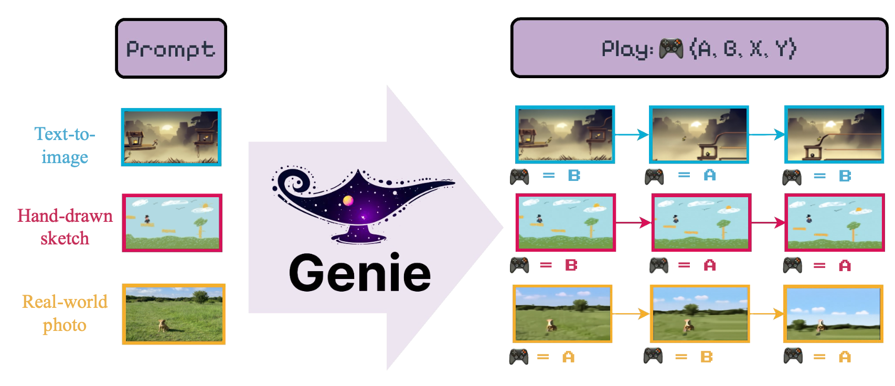

# Open-Genie: Generative Interactive Environments in PyTorch

This repo contains the _unofficial_ implementation of _Genie: Generative Interactive Environments_ [Bruce et al. (2024)](https://arxiv.org/abs/2402.15391v1?curius=4125) as introduced by Google DeepMind.

The goal of the model is to introduce "[...] The first generative interactive environment trained in an unsupervised manner from unlabelled Internet videos".



# Usage

We provide a `LightningCLI` interface to easily train the several components of the `Genie` model. In particular, to train the `VideoTokenizer` one should run the following

```bash
python tokenizer.py train -config <path_to_conf_file>
```

To train both the `LatentAction` and `Dynamics` model (use in turn would leverage a fully-trained `VideoTokenizer`), one can again simply run:

```bash
python genie.py train -config <path_to_conf_file>
```

We provide example configuration files in the `📂 config` folder.

In the following sections we provide example codes for the core building blocks that together form the overall Genie module.

## VideoTokenizer

Genie relies on a `VideoTokenizer` which digests input videos and via its `encode`-`quantize` abilities converts them into discrete tokens. These tokens are what the `Dynamics` module uses to manipulate the _latent_ video space. The `VideoTokenizer` module accepts several parameters for extensive customization, here is an example code for a typical use:

```python
from genie import VideoTokenizer

# Pre-assembled description of MagViT2
# encoder & decoder architecture
from genie import MAGVIT2_ENC_DESC
from genie import MAGVIT2_DEC_DESC

tokenizer = VideoTokenizer(
  # We can pass an arbitrary description of the
  # encoder architecture, see genie.tokenizer.get_module
  # to see which module are supported
  enc_desc = (
    'causal', { # A CausalConv3d layer
        'in_channels': 3,
        'out_channels': 64,
        'kernel_size': 3,
    }),
    ('residual', { # Residual Block
        'in_channels': 64,
        'kernel_size': 3,
        'downsample': (1, 2), # Optional down-scaling (time, space)
        'use_causal': True, # Using causal padding
        'use_blur': True, # Using blur-pooling
    }),
    ('residual', {
        'in_channels': 64,
        'out_channels': 128, # Output channels can be different
    }),
    ('residual', {
        'n_rep': 2, # We can repeat this block N-times
        'in_channels': 128,
    }),
    ('residual', {
        'in_channels': 128,
        'out_channels': 256, # We can mix different output channels...
        'kernel_size': 3,
        'downsample': 2, # ...with down-sampling (here time=space=2)
        'use_causal': True,
    }),
    ('proj_out', { # Output project to quantization module
        'in_channels': 256,
        'out_channels': 18,
        'num_groups': 8,
        'kernel_size': 3,
    }),
  # Save time, use a pre-made configuration!
  dec_desc = MAGVIT2_DEC_DESC,

  # Description of GAN discriminator
  disc_kwargs=dict(
      # Discriminator parameters
      inp_size = (64, 64), # Size of input frames
      model_dim = 64,
      dim_mults = (1, 2, 4),    # Channel multipliers
      down_step = (None, 2, 2), # Down-sampling steps
      inp_channels = 3,
      kernel_size = 3,
      num_groups = 8,
      act_fn = 'leaky', # Use LeakyReLU as activation function
      use_blur = True,  # Use BlurPooling for down-sampling
      use_attn = True,  # Discriminator can have spatial attention
      num_heads = 4,    # Number of (spatial) attention heads
      dim_head = 32,    # Dimension of each spatial attention heads
  ),

  # Keyword for the LFQ module
  d_codebook = 18, # Codebook dimension, should match encoder output channels
  n_codebook = 1, # Support for multiple codebooks
  lfq_bias = True,
  lfq_frac_sample = 1.,
  lfq_commit_weight = 0.25,
  lfq_entropy_weight = 0.1,
  lfq_diversity_weight = 1.,
  # Keyword for the different loss
  perceptual_model = 'vgg16', # We pick VGG-16 for perceptual loss
  # Which layer should we record perceptual features from
  perc_feat_layers = ('features.6', 'features.13', 'features.18', 'features.25'),
  gan_discriminate='frames', # GAN discriminator looks at individual frames
  gan_frames_per_batch = 4,  # How many frames to extract from each video to use for GAN
  gan_loss_weight = 1.,
  perc_loss_weight = 1.,
  quant_loss_weight = 1.,
)

batch_size = 4
num_channels = 3
num_frames = 16
img_h, img_w = 64, 64

# Example video tensor
mock_video = torch.randn(
  batch_size,
  num_channels,
  num_frames,
  img_h,
  img_w
)

# Tokenize input video
tokens, idxs = tokenizer.tokenize(mock_video)

# Tokenized video has shape:
# (batch_size, d_codebook, num_frames // down_time, H // down_space, W // down_space)

# To decode the video from tokens use:
rec_video = tokenizer.decode(tokens)

# To train the tokenizer (do many! times)
loss, aux_losses = tokenizer(mock_video)
loss.backward()
```

## Latent Action Model

Genie implements a `LatentAction` model whose sole task is to formalize a (discrete) codebook of latent actions. This codebook is small by design to encourage _interpretable_ actions (such as `MOVE_RIGHT`). In order to train such codebook the `LatentAction` model is build as a `VQ-VAE` model, where the encoder ingest the video (pixel) frames and produces (quantized) actions as latents. The decoder then ingest previous frame history and the current action to predict the next frame. Both the encoder and decoder are discarded at inference time as the action are provided by the user.

The `LatentAction` model follows a similar design as the `VideoTokenizer`, where the encoder/decoder architectures can be specified via a `Blueprint`. Here is an example code to highlight the core components:

```python
from genie import LatentAction
from genie import LATENT_ACT_ENC

model = LatentAction(
  # Use a pre-made configuration...
  enc_desc=LATENT_ACT_ENC,
  # ...Or specify a brand-new one
  dec_desc=(
    # Latent Action uses space-time transformer
    ('space-time_attn', {
        'n_rep' : 2,
        'n_embd' : 256,
        'n_head' : 4,
        'd_head' : 16,
        'has_ext' : True,
        # Decoder uses latent action as external
        # conditioning for decoding!
        'time_attn_kw'  : {'key_dim' : 8},
    }),
    # But we can also down/up-sample to manage resources
    # NOTE: Encoder & Decoder should work nicely together
    #       so that down/up-samples cancel out
    ('spacetime_upsample', {
        'in_channels' : 256,
        'kernel_size' : 3,
        'time_factor' : 1,
        'space_factor' : 2,
    }),
    ('space-time_attn', {
        'n_rep' : 2,
        'n_embd' : 256,
        'n_head' : 4,
        'd_head' : 16,
        'has_ext' : True,
        'time_attn_kw'  : {'key_dim' : 8},
    }),
  ),
  d_codebook=8,       # Small codebook to incentivize interpretability
  inp_channels=3,     # Input video channel
  inp_shape=(64, 64), # Spatial frame dimensions
  n_embd=256,         # Hidden model dimension
  # [...] Other kwargs for controlling LFQ module behavior
)

# Create mock input video
batch_size = 2
video_len = 16
frame_dim = 64, 64

video = torch.randn(batch_size, 3, video_len, *frame_dim)

# Encode the video to extract the latent actions
(actions, encoded), quant_loss = model.encode(video)

# Compute the reconstructed video and its loss
recon, loss, aux_losses = model(video)

# This should work!
assert recon.shape == (batch_size, 3, video_len, *frame_dim)

# Train the model
loss.backward()
```

## Dynamics Model

The `DynamicsModel` is tasked to predict the next video token based on past video token and latent action histories. The architecture is based on the `MaskGIT` model from [Chang et al, (2022)](https://arxiv.org/abs/2202.04200). Here is an example code to highlight the core components:

```python
from genie import DynamicsModel

blueprint = (
  # Describe a Space-Time Transformer
  ('space-time_attn', {
      'n_rep' : 4,     # Number of layers
      'n_embd' : 256,  # Hidden dimension
      'n_head' : 4,    # Number of attention heads
      'd_head' : 16,   # Dimension of each attention head
      'transpose' : False,
  }),
)

# Create the model
tok_codebook = 16 # Dimension of video tokenizer codebook
act_codebook =  4 # Dimension of latent action codebook
dynamics = DynamicsModel(
    desc=blueprint,
    tok_vocab=tok_codebook,
    act_vocab=act_codebook,
    embed_dim=256,          # Hidden dimension of the model
)

batch_size = 2
num_frames = 16
img_size   = 32

# Create mock token and latent action inputs
mock_tokens = torch.randint(0, tok_codebook, (batch_size, num_frames, img_size, img_size))
mock_act_id = torch.randint(0, act_codebook, (batch_size, num_frames))

# Compute the reconstruction loss based on Bernoulli
# masking of input tokens
loss = dynamics.compute_loss(
    mock_tokens,
    mock_act_id,
)

# Generate the next video token
new_tokens = dynamics.generate(
    mock_tokens,
    mock_act_id,
    steps=5, # Number of MaskGIT sampling steps
)

assert new_tokes.shape == (batch_size, num_frame + 1, img_size, img_size)
```

# Roadmap

- [x] Implement the video-tokenizer. Use the MagViT-2 tokenizer as described in [Yu et al., (2023)](https://magvit.cs.cmu.edu/v2/).
- [x] Implement the Latent Action Model, a Vector-Quantized ST-Transformer. Predict game-action from past video frames.
- [x] Implement the Dynamics Model, which takes past frames and actions and produces the new video frame.
- [ ] Add functioning training script (Lightning).
- [ ] Show some results.

# Requirements

Code was tested with Python 3.11+ and requires `torch 2.0+` (because of use of fast flash-attention). To install the required dependencies simply run `pip install -r requirements.txt`

# Citations

This repo builds upon the beautiful MagViT implementation by [lucidrains](https://github.com/lucidrains/magvit2-pytorch/tree/main) and the MaskGIT implementation from [valeoai](https://github.com/valeoai/Maskgit-pytorch/tree/main).

```bibtex
@article{bruce2024genie,
  title={Genie: Generative Interactive Environments},
  author={Bruce, Jake and Dennis, Michael and Edwards, Ashley and Parker-Holder, Jack and Shi, Yuge and Hughes, Edward and Lai, Matthew and Mavalankar, Aditi and Steigerwald, Richie and Apps, Chris and others},
  journal={arXiv preprint arXiv:2402.15391},
  year={2024}
}
```

```bibtex
@article{yu2023language,
  title={Language Model Beats Diffusion--Tokenizer is Key to Visual Generation},
  author={Yu, Lijun and Lezama, Jos{\'e} and Gundavarapu, Nitesh B and Versari, Luca and Sohn, Kihyuk and Minnen, David and Cheng, Yong and Gupta, Agrim and Gu, Xiuye and Hauptmann, Alexander G and others},
  journal={arXiv preprint arXiv:2310.05737},
  year={2023}
}
```

```bibtex
@inproceedings{chang2022maskgit,
  title={Maskgit: Masked generative image transformer},
  author={Chang, Huiwen and Zhang, Han and Jiang, Lu and Liu, Ce and Freeman, William T},
  booktitle={Proceedings of the IEEE/CVF Conference on Computer Vision and Pattern Recognition},
  pages={11315--11325},
  year={2022}
}
```
